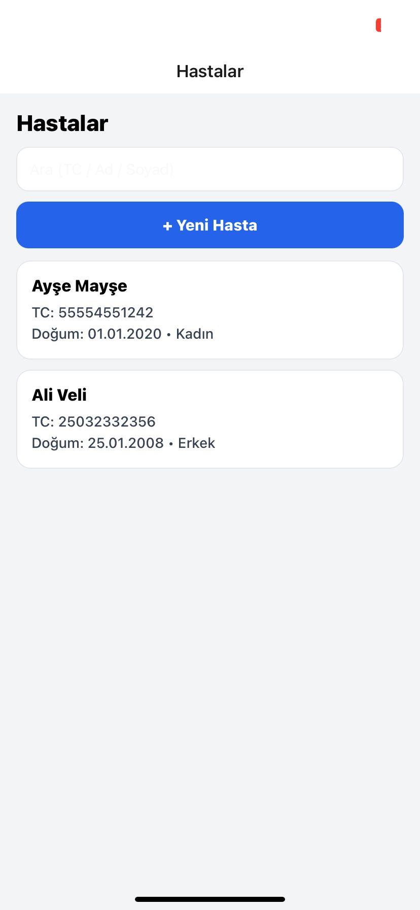
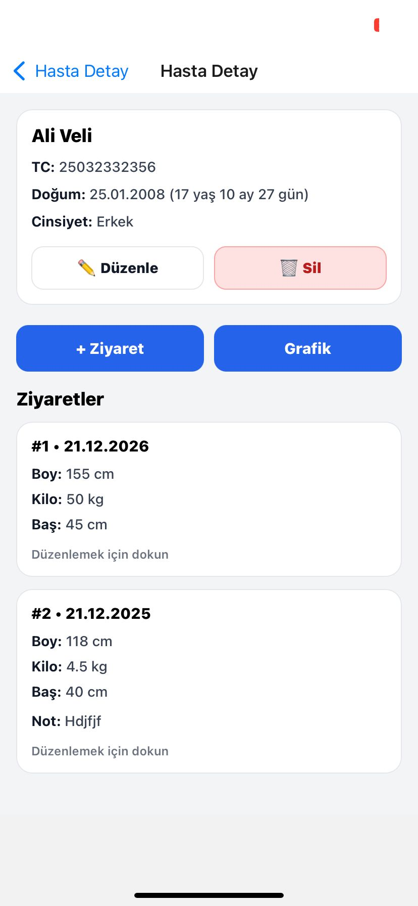
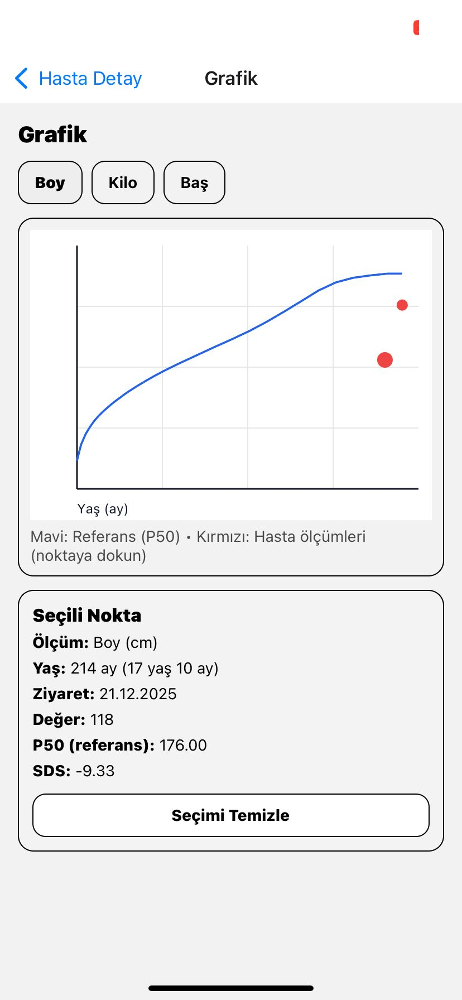
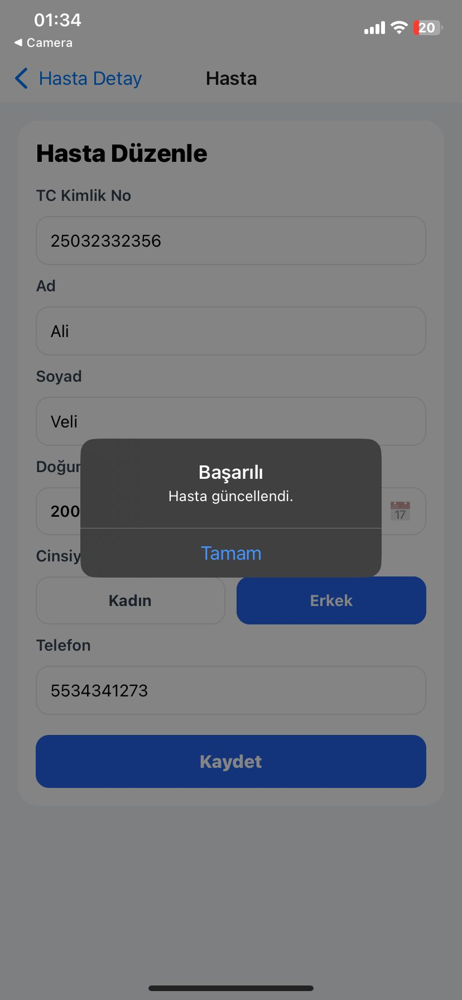
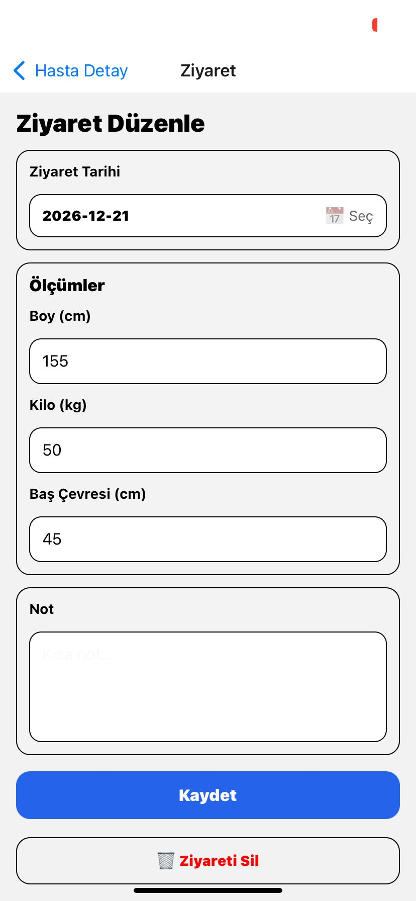
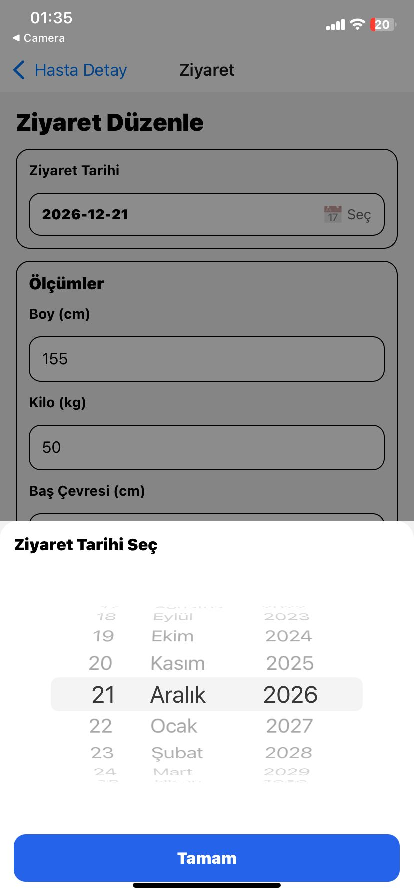

#  Patient Tracking Mobile App

A mobile patient tracking application developed with React Native and Expo.

This application allows users to manage patients, record visits, and visualize growth data through charts.

---

## Features

- Patient listing
- Patient detail view
- Add / Edit / Delete patient
- Visit management
- Anthropometric measurements (Height, Weight, Head Circumference)
- Growth chart visualization
- Data selection and detailed value display

---

## 🛠 Technologies

- React Native
- Expo
- TypeScript

---

## 📸 Screenshots

### 🧾 Patient List


### 👤 Patient Detail


### 📊 Growth Chart


### ✏️ Edit Patient


### 🩺 Visit Management


### 📅 Date Selection


---

## ▶️ How to Run

```bash
npm install
npx expo start
